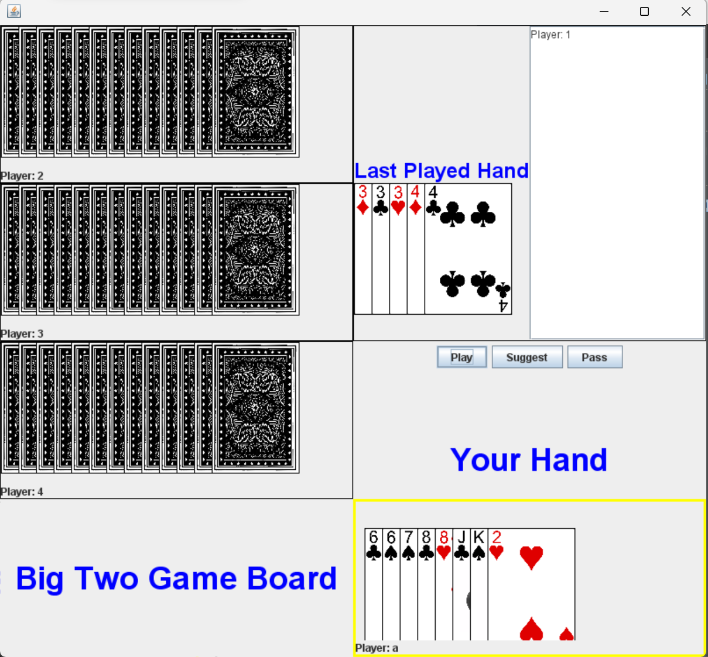
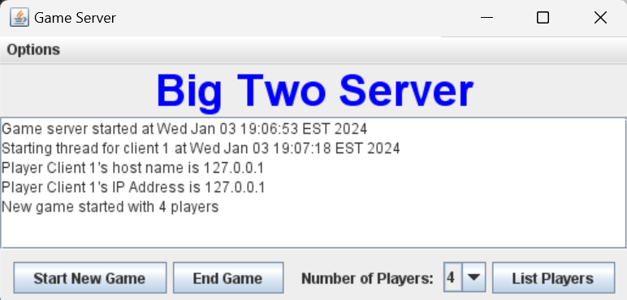
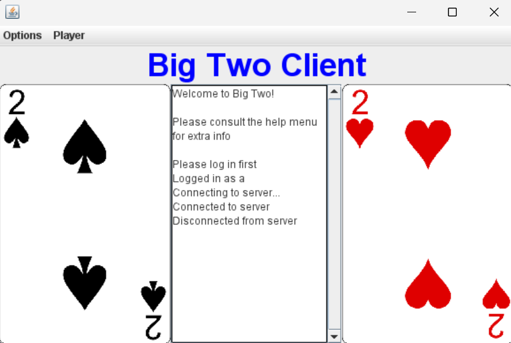

# Big-Two-Java

This is an implementation of the Big Two card game in Java.

This project makes Big Two playable for 1-4 players locally, with the option of adding computer players to the game. 

# How to Install/Run

1. Import project into chosen IDE 
2. Set up the database. A Java class file called `BigTwoDatabase.java` should set up the database with the appropriate tables. This project uses JDBC, ensure that the directory is correct. 
3. Run `GameServer.java` which will start listening for connections
4. Run `Player.java` to create player clients. Each Player client will be able to sign up and log in to their account. Once logged in, connect to the server using the JMenu option.
5. Use the `GameServer` JPanel to adjust the number of players playing, once all players are in, you can start a new game. You can also have computer players if the game is not full. 
6. Adjust players/start new games optionally. Enjoy!

# Extra Screenshots

**Server Window:**

**Client Window:**

